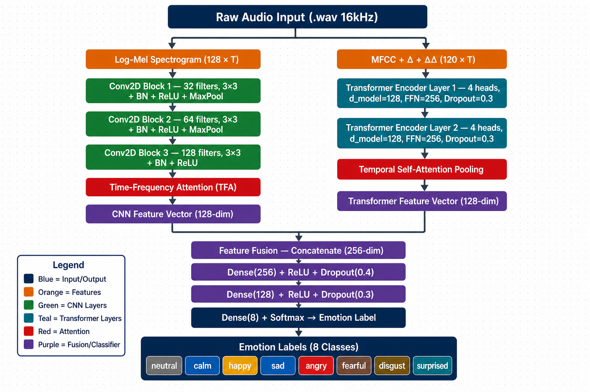

# Speech Emotion Recognition — CNN–BiLSTM–Attention on RAVDESS

> **Course project** · Speech Processing · June 2026

A hybrid deep learning system for automatic Speech Emotion Recognition (SER) using **MFCC–Mel Spectrogram feature fusion** and a **dual-branch CNN–BiLSTM–Attention** architecture, trained and evaluated on the [RAVDESS](https://zenodo.org/records/1188976) emotional speech corpus.

---

## Key Features

- **Dual-branch architecture:** CNN on log-Mel spectrograms + BiLSTM on MFCC sequences
- **Attention mechanisms:** Time-Frequency Attention (TFA) on CNN branch + Temporal Self-Attention on BiLSTM branch
- **Feature fusion:** Both branches concatenated into a unified classifier
- **Interactive demo:** Gradio web interface for real-time SER from microphone or file upload
- **Full evaluation:** Baseline comparison (SVM, CNN-only, BiLSTM-only) + ablation study

---

## Repository Structure

```
ser-ravdess-cnn-bilstm-attention/
│
├── .agent/                         # AI agent context (Cursor, Copilot, Claude, etc.)
│   ├── context.md                  # Project overview for AI agents
│   ├── tasks.md                    # Implementation checklist
│   └── agent_rules.md              # Coding conventions and agent instructions
│
├── data/
│   ├── raw/
│   │   └── ravdess/
│   │       ├── Actor_01/
│   │       ├── Actor_02/
│   │       └── .../
│   └── processed/
│       ├── metadata.csv
│       └── ravdess_features.npz
│
├── notebooks/
│   ├── 01_eda.ipynb
│   ├── 02_feature_extraction.ipynb
│   ├── 03_baseline_models.ipynb
│   ├── 04_main_model.ipynb
│   └── 05_evaluation.ipynb
│
├── src/
│   ├── data/
│   │   ├── parse_ravdess.py
│   │   ├── dataset.py
│   │   └── augment.py
│   ├── features/
│   │   └── extract.py
│   ├── models/
│   │   ├── cnn_branch.py
│   │   ├── bilstm_branch.py
│   │   ├── attention.py
│   │   └── hybrid_model.py
│   ├── training/
│   │   └── train.py
│   └── evaluation/
│       └── metrics.py
│
├── app/
│   └── gradio_app.py
│
├── models/
│   └── best_model.pt               # Saved after training (not committed to git)
│
├── reports/
│   ├── midterm_report.md
│   └── final_report.md
│
├── .gitignore
├── README.md
└── requirements.txt
```

---

## Model Architecture



```
Raw Audio (.wav, 16 kHz)
        │
        ├─────────────────────────────┐
        ▼                             ▼
Log-Mel Spec (128×T)          MFCC+Δ+ΔΔ (120×T)
        │                             │
  ┌─────────────┐             ┌──────────────────┐
  │  CNN Branch │             │  BiLSTM Branch   │
  │  Conv2D ×3  │             │  BiLSTM ×2       │
  │  TF-Attn    │             │  Temporal-Attn   │
  └──────┬──────┘             └────────┬─────────┘
         │    128-dim             128-dim    │
         └──────────────┬─────────────────┘
                        ▼
               Concatenate (256-dim)
               Dense(256) → Dense(128) → Dense(8)
                        ▼
               Emotion Label + Confidence
```

---

## Dataset

**RAVDESS** — Ryerson Audio-Visual Database of Emotional Speech and Song

| Property | Value |
|---|---|
| Files (speech only) | 1,440 `.wav` (16-bit, 48 kHz) |
| Speakers | 24 actors (12F / 12M) |
| Emotions | neutral, calm, happy, sad, angry, fearful, disgust, surprised |
| License | CC BY-NC-SA 4.0 |
| Download | https://zenodo.org/records/1188976 |

Download the audio-only speech zip (`Audio_Speech_Actors_01-24.zip`) and extract to `data/raw/ravdess/`.

---

## Setup

```bash
# 1. Clone the repo
git clone https://github.com/<your-username>/ser-ravdess-cnn-bilstm-attention.git
cd ser-ravdess-cnn-bilstm-attention

# 2. Create virtual environment
python -m venv .venv
source .venv/bin/activate       # Linux / macOS
# .venv\Scripts\activate       # Windows

# 3. Install dependencies
pip install -r requirements.txt

# 4. Download RAVDESS and extract
# Place audio files in: data/raw/ravdess/Actor_XX/
```

---

## Quick Start

```bash
# Step 1: Parse metadata and run EDA
jupyter notebook notebooks/01_eda.ipynb

# Step 2: Extract features (MFCC + Mel Spectrogram)
jupyter notebook notebooks/02_feature_extraction.ipynb

# Step 3: Train baseline models (SVM, CNN, BiLSTM)
jupyter notebook notebooks/03_baseline_models.ipynb

# Step 4: Train main CNN–BiLSTM–Attention model
jupyter notebook notebooks/04_main_model.ipynb

# Step 5: Evaluate and compare all models
jupyter notebook notebooks/05_evaluation.ipynb

# Step 6: Launch Gradio demo
python app/gradio_app.py
```

---

## Results (Target)

| Model | Accuracy | Weighted F1 |
|---|---|---|
| SVM + MFCC (B0) | ~65–75% | — |
| CNN — Mel Spec (B1) | ~81–90% | — |
| BiLSTM — MFCC (B2) | ~80–88% | — |
| **CNN–BiLSTM–Attention (P1)** | **≥ 92%** | **—** |

*Results will be filled in after training.*

---

## Tech Stack

| Component | Tool |
|---|---|
| Audio processing | `librosa`, `soundfile`, `torchaudio` |
| Deep learning | `PyTorch ≥ 2.0` |
| Data / metrics | `numpy`, `pandas`, `scikit-learn` |
| Visualization | `matplotlib`, `seaborn` |
| Demo UI | `gradio ≥ 4.0` |
| Experiment tracking | `tensorboard` |
| Compute | Kaggle GPU (T4/P100) / Google Colab |

---

## Team

| Member | Role |
|---|---|
| [Name 1] | Data Engineer + Feature Extraction |
| [Name 2] | Model Development + Evaluation & UI |

---

## License

This project is for educational purposes only.  
RAVDESS dataset: [CC BY-NC-SA 4.0](https://creativecommons.org/licenses/by-nc-sa/4.0/)

---

## Key References

1. Livingstone & Russo (2018). *RAVDESS*. PLOS ONE. https://zenodo.org/records/1188976
2. Poorna et al. (2025). Hybrid CNN-BiLSTM + Attention for SER. *Biomedical Signal Processing and Control*.
3. ETASR (2026). Real-time SER with CNN-BiLSTM-Attention. 98.10% on RAVTESS.
4. Scientific Reports (2025). Stacked CNN for multi-feature SER. 93.30% on RAVDESS.

---

## Gradio Demo App

Run the polished Speech Emotion Recognition demo locally:

```bash
pip install -r requirements.txt
python app.py
```

Or run it directly with `uv` without manually creating an environment:

```bash
uv run --with-requirements requirements.txt python app.py
```

By default the app requests a public Gradio share link. If Gradio prints `Could not create share link`, the local app is still running, but the machine could not reach Gradio's public tunnel service. Retry with:

```bash
uv run --with-requirements requirements.txt python app.py --share
```

For local/LAN use without a Gradio public URL:

```bash
uv run --with-requirements requirements.txt python app.py --no-share --server-name 0.0.0.0
```

If you still need a public URL and Gradio share is unavailable, install a tunnel tool such as Cloudflare Tunnel and run it against the local app:

```bash
cloudflared tunnel --url http://127.0.0.1:7860
```

The UI opens a `gr.Blocks` app with an upload/microphone audio widget, waveform plot, Mel spectrogram plot, predicted emotion card, 8-class horizontal probability chart, top-3 predictions, and an expandable model details panel. The expected screenshot shows a two-column top area for audio input and signal plots, followed by a full-width prediction and probability section.

### Demo Model Card

| Field | Value |
|---|---|
| Architecture | Dual-stream CNN-Transformer |
| Inputs | 3-channel Mel stream `(1, 3, 128, 300)` and MFCC stream `(1, 300, 134)` |
| Dataset | RAVDESS speech subset, 24 actors, 8 emotions, 1440 samples |
| Classes | neutral, calm, happy, sad, angry, fearful, disgust, surprised |
| Validation | Accuracy 72.22%, Macro-F1 71.79% |
| Speaker-disjoint test | Accuracy 48.33% |
| Training | Mixup augmentation (alpha=0.4), AdamW, CosineAnnealingLR |
| Checkpoint | `best_model.pth` if present, otherwise `outputs/p2_cnn_transformer_best.pt` |

Limitations: the model is trained on acted RAVDESS speech and may not generalize to spontaneous speech, unseen microphones, background noise, non-English speech, or long conversational audio without additional fine-tuning.
